```mermaid
graph TD
    %% STAKEHOLDERS
    LS[👨‍🌾<br/>Livestock<br/>Suppliers]
    PPM[👨‍💼<br/>Processing Plant<br/>Manager]
    WM[👨‍🔧<br/>Warehouse<br/>Manager]
    RO[🏪<br/>Retail Shop<br/>Owner]
    GI[👮‍♂️<br/>Government<br/>Inspector]
    TP[🚛<br/>Transportation<br/>Personnel]
    SO[👨‍💻<br/>System<br/>Operator]
    EC[👥<br/>End<br/>Consumers]

    %% PHYSICAL LOCATIONS
    PP[🏭<br/>Processing Plant<br/>Digital Enabled]
    WH[🏢<br/>Warehouse<br/>Smart Monitoring]

    %% CORE DIGITAL SYSTEM
    DIMS[💻<br/>Central Digital<br/>Inventory System]

    %% REQUIREMENT MODULES
    PDD[📝<br/>Product Data<br/>Animal Type Cut Type<br/>Processing Date<br/>Storage Requirements<br/>Shelf Life Packaging<br/>Supplier Information]

    LM[📊<br/>Livestock Monitoring<br/>Quantities<br/>Processing Dates<br/>Movement Tracking<br/>Quality Control]

    MST[📈<br/>Multi-Facility<br/>Stock Tracking<br/>Real-time Levels<br/>Restocking Alerts<br/>Stockout Prevention]

    FIFO[🔄<br/>FIFO FEFO System<br/>Expiration Tracking<br/>Batch Numbers<br/>Rotation Alerts<br/>Waste Minimization]

    SENS[🌡️<br/>IoT Sensors<br/>Temperature<br/>Humidity<br/>Real-time Monitoring<br/>Quality Preservation]

    YA[📊<br/>Yield Analysis<br/>Meat Yields<br/>Trimmings Tracking<br/>Bones and Offal<br/>Efficiency Assessment<br/>Waste Reduction]

    CR[⚖️<br/>Compliance System<br/>Food Safety Records<br/>Batch Traceability<br/>Quick Recall<br/>Regulatory Reports]

    %% ADDITIONAL DIGITAL SYSTEMS FOR TRANSPORTATION, RETAIL, CONSUMERS
    RTS[📱<br/>Real-Time Tracking<br/>Product Scanning<br/>Location Tracking<br/>Route Optimization<br/>Digital Confirmation]

    DTS[🔍<br/>Digital Traceability<br/>Full Product History<br/>Batch Information<br/>Expiry Alerts<br/>Quality Assurance Data]

    QHS[📋<br/>Quality History<br/>Complete Product Info<br/>Safety Records<br/>Recall Capability<br/>Consumer Transparency]

    %% SYSTEM CONNECTIONS
    LS -->|"Delivers livestock"| PP
    LS -->|"Digital livestock data"| LM
    LM -->|"Feeds into"| DIMS
    PPM -->|"Manages"| PP
    PP -->|"Captures detailed data"| PDD
    PDD -->|"Stored in"| DIMS
    PP -->|"Yield tracking"| YA
    YA -->|"Analysis to"| DIMS
    PP -->|"Products to"| WH
    WH -->|"Stock levels"| MST
    MST -->|"Updates"| DIMS
    WH -->|"Environmental data"| SENS
    SENS -->|"Monitors"| DIMS
    DIMS -->|"FIFO FEFO alerts"| FIFO
    FIFO -->|"Rotation guidance"| WM
    WM -->|"Manages"| WH
    DIMS -->|"Compliance data"| CR
    CR -->|"Reports to"| GI
    GI -->|"Regulatory oversight"| DIMS
    SO -->|"Maintains"| DIMS

    %% CORRECTED DISTRIBUTION CHAIN - ARROWS FLOW FROM SYSTEMS TO STAKEHOLDERS
    WH -->|"Ships products"| TP
    TP -->|"Scans products for tracking"| RTS
    DIMS -->|"Provides tracking data"| RTS
    TP -->|"Delivers with digital confirmation"| RO
    DIMS -->|"Provides traceability data"| DTS
    DTS -->|"Batch and expiry information"| RO
    RO -->|"Serves traceable products"| EC
    DIMS -->|"Provides quality data"| QHS
    QHS -->|"Product transparency info"| EC

    %% STYLING
    classDef stakeholder fill:#e1f5fe,stroke:#0277bd,stroke-width:2px
    classDef location fill:#e8f5e8,stroke:#388e3c,stroke-width:2px
    classDef system fill:#f3e5f5,stroke:#7b1fa2,stroke-width:2px
    classDef requirement fill:#fff8e1,stroke:#f57f17,stroke-width:2px
    classDef enhanced fill:#e8f5e8,stroke:#2e7d32,stroke-width:2px

    class LS,PPM,WM,RO,GI,TP,SO,EC stakeholder
    class PP,WH location
    class DIMS system
    class PDD,LM,MST,FIFO,SENS,YA,CR requirement
    class RTS,DTS,QHS enhanced
```

# CSE303 Project Documentation - Inventory Management for Meat-based Products in Bangladesh

## Project Overview

**Topic**: Inventory Management for Meat-based Products in Bangladesh
**Focus**: Track meat products from processing to distribution, minimizing spoilage and waste.

## Project Requirements (7 Core Requirements)

1. **Detailed data on meat products**, including animal type (e.g., beef, poultry, pork), cut type, processing date, storage requirements, shelf life, packaging details, and supplier information.

2. **Monitoring of incoming livestock or meat cuts**, including quantities, processing dates, and movement across processing units, ensuring traceability and quality control.

3. **Continuous tracking of stock levels** across multiple storage facilities, enabling timely restocking and reducing the risk of stockouts or overstocking.

4. **Tracking of product expiration dates and batch numbers** to facilitate First-In, First-Out (FIFO) or First-Expired, First-Out (FEFO) inventory rotation, minimizing spoilage and waste.

5. **Integration with sensors** to monitor storage conditions such as temperature and humidity, ensuring optimal environments for preserving meat quality.

6. **Recording and analyzing data on meat yields** from processing activities, including tracking of trimmings, bones, and offal, to assess processing efficiency and identify areas for waste reduction.

7. **Maintaining detailed records** to comply with food safety regulations, including the ability to quickly trace and recall specific batches in the event of a food safety issue, ensuring consumer safety and regulatory adherence.

---

## Rich Pictures

### As-Is Rich Picture (Current System)

**Description**: Shows the current manual system with paper records, manual processes, and resulting problems like spoilage, waste, and lack of traceability.

**Mermaid Code:**



```mermaid
graph TD
    %% STAKEHOLDERS
    LS[👨‍🌾<br/>Livestock<br/>Suppliers]
    PPM[👨‍💼<br/>Processing Plant<br/>Manager]
    WM[👨‍🔧<br/>Warehouse<br/>Manager]
    RO[🏪<br/>Retail Shop<br/>Owner]
    GI[👮‍♂️<br/>Government<br/>Inspector]
    TP[🚛<br/>Transportation<br/>Personnel]
    SO[👨‍💻<br/>System<br/>Operator]
    EC[👥<br/>End<br/>Consumers]

    %% PHYSICAL LOCATIONS
    PP[🏭<br/>Processing<br/>Plant]
    WH[🏢<br/>Warehouse/<br/>Cold Storage]

    %% TOOLS/SYSTEMS
    PR[📋<br/>Paper Records]
    MS[📊<br/>Manual<br/>Spreadsheets]
    TG[🌡️<br/>Temperature<br/>Gauge]

    %% PROBLEMS/ISSUES
    SP[❌<br/>Spoilage &<br/>Waste]
    NT[❓<br/>No<br/>Traceability]
    MC[📞<br/>Manual<br/>Communication]
    FS[⚠️<br/>Food Safety<br/>Risks]

    %% MAIN FLOWS
    LS -->|"Delivers livestock<br/>(verbal agreements)"| PP
    PPM -->|"Manages operations at"| PP
    PP -->|"Records on paper<br/>(inconsistent)"| PR
    PP -->|"Manual temperature checks<br/>(unreliable)"| TG
    PP -->|"Transfers processed meat to"| WH
    WM -->|"Manages inventory at"| WH
    WH -->|"Manual stock counting<br/>(time consuming)"| MS
    WH -->|"Phone calls for<br/>stock updates"| MC
    WH -->|"Ships products<br/>(no batch tracking)"| TP
    TP -->|"Delivers to shops<br/>(paper receipts)"| RO
    RO -->|"Sells to customers<br/>(no expiry tracking)"| EC
    GI -->|"Manual inspections<br/>(limited records)"| PP
    GI -->|"Checks storage<br/>(spot checks only)"| WH
    SO -->|"Enters data manually<br/>(prone to errors)"| MS

    %% PROBLEM CONNECTIONS
    PR -->|"Leads to"| NT
    TG -->|"Causes"| SP
    MS -->|"Results in"| FS
    MC -->|"Creates"| SP

    %% STYLING
    classDef stakeholder fill:#e1f5fe,stroke:#0277bd,stroke-width:2px
    classDef location fill:#e8f5e8,stroke:#388e3c,stroke-width:2px
    classDef system fill:#fff3e0,stroke:#f57c00,stroke-width:1px
    classDef problem fill:#ffebee,stroke:#d32f2f,stroke-width:2px

    class LS,PPM,WM,RO,GI,TP,SO,EC stakeholder
    class PP,WH location
    class PR,MS,TG system
    class SP,NT,MC,FS problem
```

### To-Be Rich Picture (Proposed Digital System)

**Description**: Shows the proposed digital transformation with Central Digital Inventory System, 7 requirement modules, and enhanced digital capabilities for all stakeholders.

**Key Features**:

- ✅ Added: Livestock Suppliers → "Delivers livestock" → Processing Plant Digital Enabled
- ✅ Consolidated: Single "Warehouse Smart Monitoring" (instead of 3 warehouses)
- ✅ Enhanced: Digital systems for Transportation, Retail, and Consumers
- ✅ Corrected: Data flows from systems TO stakeholders

**Mermaid Code:**



---

## Gap Analysis (from gap_analysis.csv)

| Stakeholder | Current State (As-Is) | Desired State (To-Be) | Gap Analysis |
|-------------|----------------------|----------------------|--------------|
| **Livestock Suppliers** | Deliver animals with verbal agreements and basic paper documentation | Provide digital delivery records with QR codes, timestamps, and complete animal information (type, weight, health status) | Gap: No digital tracking, missing detailed animal data, no integration with processing systems |
| **Processing Plant Manager** | Manages operations manually, records information on inconsistent paper forms, conducts unreliable manual temperature checks | Oversees digitally-enabled operations with automated data capture, real-time monitoring, and integrated yield analysis | Gap: No automated data capture, no real-time visibility, no yield tracking and efficiency analysis |
| **Warehouse Manager** | Manually counts stock, uses basic spreadsheets, makes phone calls for stock updates, no systematic inventory rotation | Receives real-time inventory data, automated FIFO/FEFO alerts, manages multiple facilities through integrated dashboard | Gap: No real-time visibility, no automated rotation system, no multi-facility coordination |
| **Government Inspector** | Conducts manual spot checks with limited records access, relies on paper-based compliance verification | Accesses real-time compliance reports, complete digital audit trails, automated regulatory reporting | Gap: Limited data access, no real-time compliance monitoring, manual verification processes |
| **Transportation Personnel** | Moves products with paper receipts, no tracking during transit, manual delivery confirmation | Scans products for real-time location tracking, digital delivery confirmation, integrated route optimization | Gap: No transit visibility, no real-time tracking, manual documentation processes |
| **System Operator** | Manually enters data into disconnected spreadsheets, prone to errors, time-consuming data management | Monitors integrated digital platform with automated processes, exception-based management, system maintenance | Gap: Manual data entry, disconnected systems, no automation, high error rates |
| **Retail Shop Owner** | Receives products without systematic expiry tracking, no traceability information, manual inventory management | Receives products with full digital traceability, expiry alerts, batch information, and quality assurance data | Gap: No traceability, no expiry management, no quality information, manual processes |
| **End Consumers** | Purchase products with potential safety risks, no traceability information, limited quality assurance | Purchase safe, traceable products with complete quality history and recall capability | Gap: No product traceability, safety risks, no quality transparency, limited recall capability |

---

## Project Report

### Problem Statement

The current meat processing and distribution system in Bangladesh faces significant challenges in tracking products from processing to distribution, resulting in substantial spoilage and waste. The existing manual processes lack real-time visibility, proper traceability, and automated inventory management, leading to food safety risks, regulatory compliance issues, and economic losses. There is an urgent need for a comprehensive digital inventory management system that can monitor meat products throughout the supply chain, ensure quality preservation through environmental controls, and provide complete traceability from livestock suppliers to end consumers while minimizing waste and maintaining food safety standards.

### Existing System (Rich Picture As-Is) Explanation

The current system operates entirely on manual processes with significant inefficiencies. Livestock suppliers deliver animals through verbal agreements with basic paper documentation. The processing plant manager manually oversees operations using inconsistent paper records and unreliable temperature gauges for monitoring. Warehouse managers conduct time-consuming manual stock counts using basic spreadsheets and rely on phone calls for stock updates. Transportation personnel move products with paper receipts without any batch tracking capabilities. Government inspectors perform limited manual spot checks with restricted access to records. The system operator manually enters data into disconnected spreadsheets, making the process error-prone and time-consuming. This manual approach results in critical problems including spoilage and waste due to poor temperature monitoring, complete lack of product traceability, food safety risks from inadequate record-keeping, and inefficient communication channels that further contribute to waste and operational inefficiencies.

### Methodology

The proposed digital transformation follows a comprehensive systems integration approach, implementing seven core requirements for effective meat inventory management:

1. **Detailed Product Data Management** - Capturing animal type, cut type, processing dates, storage requirements, shelf life, and packaging details
2. **Livestock Monitoring** - Real-time tracking of quantities, processing dates, and movement across facilities
3. **Multi-Facility Stock Tracking** - Continuous monitoring of inventory levels with automated restocking alerts
4. **FIFO/FEFO Implementation** - Automated rotation systems based on expiration dates and batch numbers
5. **Environmental Monitoring** - IoT sensors for temperature and humidity control
6. **Yield Analysis** - Comprehensive tracking of processing efficiency and waste reduction
7. **Regulatory Compliance** - Complete digital audit trails with quick recall capabilities

### Proposed System (Rich Picture To-Be) Explanation

The proposed digital inventory management system transforms the entire supply chain through integrated technology solutions. Livestock suppliers now provide digital delivery records with QR codes and timestamps directly to the digitally-enabled processing plant. The central digital inventory system serves as the core hub, connecting all stakeholders and managing seven specialized modules: Product Data, Livestock Monitoring, Multi-Facility Stock Tracking, FIFO/FEFO System, IoT Sensors, Yield Analysis, and Compliance System. The warehouse operates with smart monitoring capabilities, providing real-time stock levels and environmental data. Transportation personnel utilize real-time tracking systems with product scanning and route optimization. Retail shop owners receive comprehensive digital traceability information including batch details and expiry alerts. End consumers gain access to complete quality history and product transparency through the quality history system. The government inspector benefits from automated regulatory reporting and real-time compliance monitoring. All systems are maintained by the system operator through the central digital platform, ensuring seamless integration and automated processes that eliminate manual errors, reduce waste, ensure food safety, and provide complete traceability throughout the meat product supply chain in Bangladesh.

---

## Key Changes Made During Development

### Rich Picture Modifications

1. **Added Missing Arrow**: Livestock Suppliers → "Delivers livestock" → Processing Plant Digital Enabled
2. **Consolidated Warehouses**: Changed from 3 separate warehouses to 1 "Warehouse Smart Monitoring"
3. **Enhanced Distribution Chain**: Added digital systems for Transportation Personnel, Retail Shop Owner, and End Consumers
4. **Corrected Arrow Directions**: Ensured data flows FROM systems TO stakeholders (not the reverse)

### Requirement Coverage Verification

✅ **Requirement 1**: Product Data module covers animal type, cut type, processing date, storage requirements, shelf life, packaging, supplier info
✅ **Requirement 2**: Livestock Monitoring module handles quantities, processing dates, movement tracking, quality control
✅ **Requirement 3**: Multi-Facility Stock Tracking provides real-time levels, restocking alerts, stockout prevention
✅ **Requirement 4**: FIFO/FEFO System manages expiration tracking, batch numbers, rotation alerts, waste minimization
✅ **Requirement 5**: IoT Sensors monitor temperature, humidity, real-time conditions, quality preservation
✅ **Requirement 6**: Yield Analysis tracks meat yields, trimmings, bones, offal, efficiency assessment, waste reduction
✅ **Requirement 7**: Compliance System maintains food safety records, batch traceability, quick recall, regulatory reports

### Stakeholder Coverage

✅ All 8 stakeholders from gap analysis properly represented
✅ All digital capabilities from gap analysis implemented
✅ Complete alignment between As-Is, To-Be, and Gap Analysis
✅ Proper data flow logic throughout the system

---

## Flask Application (Technical Implementation)

### Current Status

- ✅ **Flask Backend**: Complete with authentication routes
- ✅ **MySQL Integration**: Successfully connected to MySQL Workbench
- ✅ **User Authentication**: Working registration/login system
- ✅ **Database Setup**: User "abbas" successfully created and tested
- ✅ **Application Running**: <http://localhost:5000> with MySQL backend

### Database Configuration

- **Database Type**: MySQL
- **Host**: localhost:3306
- **Database Name**: cse303_project
- **User**: root
- **Password**: 64151052
- **Status**: ✅ Connected and operational

### Framework Architecture (Ready for Meat Inventory Implementation)

#### ✅ **1. Flask Backend with Proper Structure**

- **`app.py`**: Well-organized Flask application with proper routing (137 lines)
- **`database.py`**: Separate database module for clean architecture (341 lines)
- **`config.py`**: Configuration management
- **`templates/`**: Organized template structure with auth subfolder
- **`static/`**: CSS and JavaScript assets

#### ✅ **2. Flask-Login Authentication System**

- **Secure password hashing**: SHA-256 implementation
- **User class**: Proper UserMixin implementation
- **Login/logout routes**: Complete authentication flow
- **Session management**: Secure user sessions
- **Access control**: `@login_required` decorator

#### ✅ **3. Bootstrap 5 Frontend with Responsive Design**

- **`base.html`**: Bootstrap 5 CDN integration
- **Responsive navigation**: Mobile-friendly navbar
- **Modern UI components**: Cards, forms, buttons
- **Interactive elements**: Dropdowns, alerts, modals ready
- **Custom CSS**: Additional styling in `static/css/custom.css`

#### ✅ **4. Manual SQL Operations (No ORM)**

- **Raw SQL queries**: Direct database operations
- **`execute_query()` function**: Parameterized queries for security
- **Database-agnostic**: Works with both SQLite and MySQL
- **Manual schema management**: Direct table creation

#### ✅ **5. MySQL Database with Proper Schema Design**

- **Multi-database support**: SQLite + MySQL
- **Currently connected**: MySQL Workbench (cse303_project database)
- **Proper charset**: utf8mb4_unicode_ci for international support
- **Foreign key constraints**: Proper relationships

#### ✅ **6. Activity Logging System**

- **`activity_log` table**: User action tracking
- **`log_activity()` function**: Automatic logging
- **IP address tracking**: Security monitoring
- **Timestamp tracking**: Complete audit trail

#### ✅ **7. Modern UI with Cards, Forms, and Interactive Elements**

- **Dashboard**: Statistics cards, quick actions
- **Forms**: Styled login/register forms
- **Navigation**: User dropdown, responsive design
- **Flash messages**: User feedback system

### Current Database Schema (Implemented)

#### **Users Table** ✅

```sql
CREATE TABLE users (
    id INT AUTO_INCREMENT PRIMARY KEY,
    username VARCHAR(50) UNIQUE NOT NULL,
    email VARCHAR(100) UNIQUE NOT NULL,
    password_hash VARCHAR(255) NOT NULL,
    created_at TIMESTAMP DEFAULT CURRENT_TIMESTAMP,
    updated_at TIMESTAMP DEFAULT CURRENT_TIMESTAMP ON UPDATE CURRENT_TIMESTAMP
) ENGINE=InnoDB DEFAULT CHARSET=utf8mb4 COLLATE=utf8mb4_unicode_ci;
```

#### **Sample_data Table** ✅ (Template for meat inventory tables)

```sql
CREATE TABLE sample_data (
    id INT AUTO_INCREMENT PRIMARY KEY,
    user_id INT,
    title VARCHAR(255) NOT NULL,
    description TEXT,
    status VARCHAR(20) DEFAULT 'active',
    created_at TIMESTAMP DEFAULT CURRENT_TIMESTAMP,
    updated_at TIMESTAMP DEFAULT CURRENT_TIMESTAMP ON UPDATE CURRENT_TIMESTAMP,
    FOREIGN KEY (user_id) REFERENCES users (id) ON DELETE CASCADE
) ENGINE=InnoDB DEFAULT CHARSET=utf8mb4 COLLATE=utf8mb4_unicode_ci;
```

#### **Activity_log Table** ✅

```sql
CREATE TABLE activity_log (
    id INT AUTO_INCREMENT PRIMARY KEY,
    user_id INT,
    action VARCHAR(100) NOT NULL,
    description TEXT,
    ip_address VARCHAR(45),
    created_at TIMESTAMP DEFAULT CURRENT_TIMESTAMP,
    FOREIGN KEY (user_id) REFERENCES users (id) ON DELETE CASCADE
) ENGINE=InnoDB DEFAULT CHARSET=utf8mb4 COLLATE=utf8mb4_unicode_ci;
```

#### **Performance Indexes** ✅

```sql
CREATE INDEX idx_users_username ON users(username);
CREATE INDEX idx_users_email ON users(email);
CREATE INDEX idx_sample_data_user_id ON sample_data(user_id);
CREATE INDEX idx_activity_log_user_id ON activity_log(user_id);
```

### Key Application Functions (Implemented)

#### **Authentication Functions**

- `hash_password()` - SHA-256 password hashing
- `load_user()` - Flask-Login user loader
- Login/register/logout routes with proper validation

#### **Database Functions**

- `get_db_connection()` - Database connection management
- `init_database()` - Table creation and schema setup
- `execute_query()` - Parameterized query execution
- `get_user_by_id()` / `get_user_by_username()` - User retrieval
- `create_user()` - User registration
- `log_activity()` - Activity logging
- `get_user_stats()` - Dashboard statistics
- `test_connection()` - Database connectivity testing

### Key Files Structure

- `app.py` - Main Flask application (137 lines)
- `database.py` - Database utilities (341 lines)
- `gap_analysis.csv` - Stakeholder gap analysis data
- `config.py` - Configuration settings
- `mysql_config.py` - MySQL setup script
- `requirements.txt` - Python dependencies
- `templates/base.html` - Bootstrap 5 base template
- `templates/dashboard.html` - User dashboard
- `templates/index.html` - Home page
- `templates/auth/login.html` - Login form
- `templates/auth/register.html` - Registration form
- `static/css/custom.css` - Custom styling
- `static/js/main.js` - JavaScript functionality

### Ready for Meat Inventory Implementation

The framework is **perfectly set up** to implement the meat inventory management system with all 7 requirements. You can now:

1. **Add new tables** for meat products, livestock, warehouses, suppliers, etc.
2. **Create new routes** for inventory management functions
3. **Build new templates** for meat inventory UI
4. **Implement stakeholder-specific dashboards** for different user roles
5. **Add the 7 requirement modules** using the existing structure

---

## Project Status Summary

### ✅ Completed

1. **Rich Pictures**: Both As-Is and To-Be diagrams created and verified
2. **Gap Analysis**: Complete stakeholder analysis with 8 stakeholders
3. **Project Report**: Problem statement, methodology, system explanations
4. **Requirement Coverage**: All 7 core requirements implemented
5. **Flask Application**: Working web application with MySQL database
6. **Documentation**: Comprehensive project documentation

### 🎯 Next Steps

- Database schema design for meat inventory management
- Implementation of the 7 requirement modules
- User interface design for different stakeholder roles
- Integration of IoT sensor data simulation
- Testing and validation of the complete system

---

## Conversation History & Context (For Future Reference)

### Memory Management Issue

The user has noted that the assistant tends to forget chat history across sessions, requiring repeated explanations of the project context. This documentation file was created to preserve all important context for future conversations.

### Development Journey

#### **Initial Setup Phase**

- User had existing Flask application with Bootstrap frontend
- Flask-Login authentication system already implemented
- Manual SQL operations (no ORM as required by faculty)
- Support for both SQLite and MySQL databases
- User "abbas" successfully created and authenticated
- Application running on <http://localhost:5000> with MySQL backend
- Database: cse303_project, host: localhost:3306, user: root, password: 64151052

#### **Project Requirements Definition**

The user provided 7 core requirements for the meat inventory management system:

1. Detailed data on meat products (animal type, cut type, processing date, storage requirements, shelf life, packaging details, supplier information)
2. Monitoring incoming livestock/meat cuts with quantities, processing dates, movement tracking, quality control
3. Continuous stock level tracking across multiple storage facilities with restocking alerts
4. FIFO/FEFO inventory rotation tracking with expiration dates and batch numbers
5. IoT sensor integration for temperature and humidity monitoring
6. Meat yield analysis tracking (trimmings, bones, offal) for efficiency assessment
7. Regulatory compliance with food safety records, batch traceability, and quick recall capability

#### **Rich Picture Development Process**

1. **As-Is Rich Picture**: Created showing current manual system with 8 stakeholders using paper records, manual spreadsheets, temperature gauges, leading to problems like spoilage, waste, no traceability, and food safety risks.

2. **To-Be Rich Picture**: Developed digital transformation with Central Digital Inventory System connecting all stakeholders through 7 requirement modules plus additional digital systems for transportation, retail, and consumer transparency.

3. **Iterative Improvements Made**:
   - Added missing arrow: Livestock Suppliers → "Delivers livestock" → Processing Plant Digital Enabled
   - Consolidated warehouses: Changed from 3 separate warehouses to 1 "Warehouse Smart Monitoring" per faculty feedback
   - Enhanced distribution chain: Added Real-Time Tracking System, Digital Traceability System, and Quality History System
   - Corrected arrow directions: Ensured data flows FROM systems TO stakeholders (not reverse)

#### **Gap Analysis Creation**

- Complete stakeholder analysis provided in gap_analysis.csv file
- Showed transformation from manual processes to digital systems for all 8 stakeholders
- Identified gaps like lack of digital tracking, no real-time visibility, manual data entry, no automation, and missing traceability

#### **Project Report Structure**

Created comprehensive project report including:

- **Problem Statement**: Current manual system challenges leading to spoilage, waste, food safety risks
- **Existing System Explanation**: Manual processes with paper records, spreadsheets, verbal agreements
- **Gap Analysis**: Detailed stakeholder transformation requirements
- **Methodology**: 7-requirement digital transformation approach
- **Proposed System Explanation**: Integrated digital platform with central inventory system

#### **Technical Framework Verification**

Confirmed the existing Flask application framework includes:

- ✅ Flask backend with proper structure and organization
- ✅ Flask-Login authentication with secure password hashing
- ✅ Bootstrap 5 frontend with responsive design
- ✅ Manual SQL operations (no ORM)
- ✅ MySQL database with proper schema design
- ✅ Activity logging system for user action tracking
- ✅ Modern UI with cards, forms, interactive elements
- ✅ Database tables: users, sample_data, activity_log with proper indexes

### Files Deleted During Development

- `check_users.py` - Temporary testing file
- `test_abbas.py` - Temporary testing file

### Key Mermaid Codes (For Reference)

#### As-Is Rich Picture (Current Manual System)


#### To-Be Rich Picture (Digital Transformation)


### Current Project Status

- **Phase**: Requirements and design completed
- **Rich Pictures**: Both As-Is and To-Be verified and aligned
- **Gap Analysis**: Complete with all 8 stakeholders
- **Flask Framework**: Ready for meat inventory implementation
- **Database**: MySQL connected and operational
- **Next Steps**: Implementation of meat inventory management system

### Important Notes for Future Sessions

1. **User "abbas"** is the test user account (password: abbas123)
2. **Database connection verified** - MySQL on localhost:3306
3. **All 7 requirements covered** in the rich pictures and gap analysis
4. **Framework is complete** - ready to build meat inventory features
5. **Documentation purpose**: Prevent loss of context across sessions

---

**Last Updated**: Current session - All rich pictures, gap analysis, project report, and technical framework details completed and verified.
**Documentation Created**: For easy reference and continuation of work without losing chat history context.
